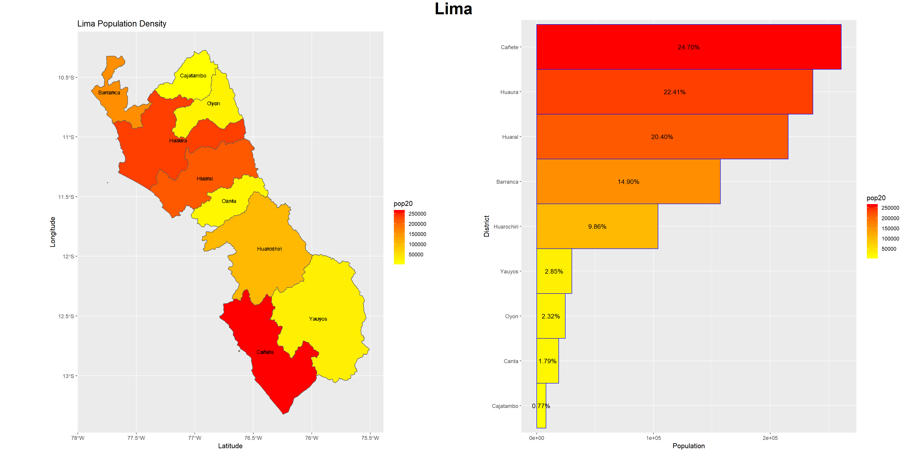
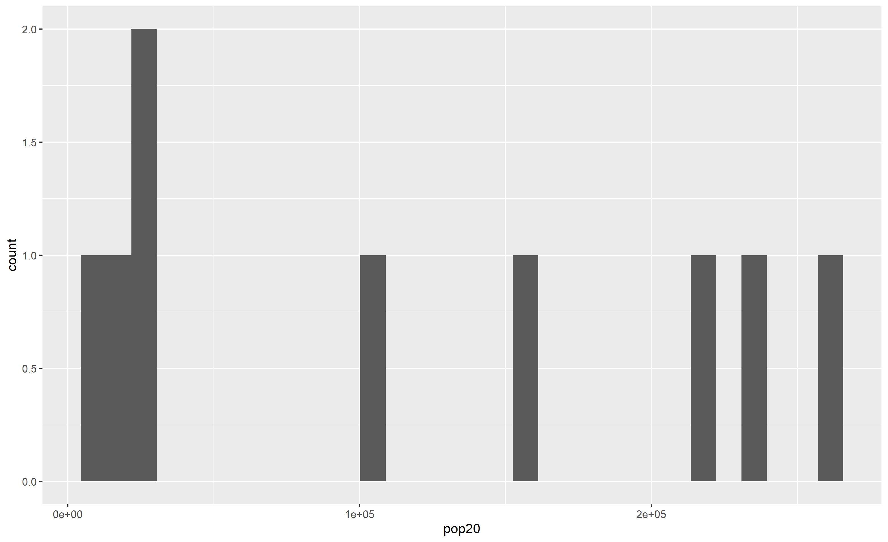
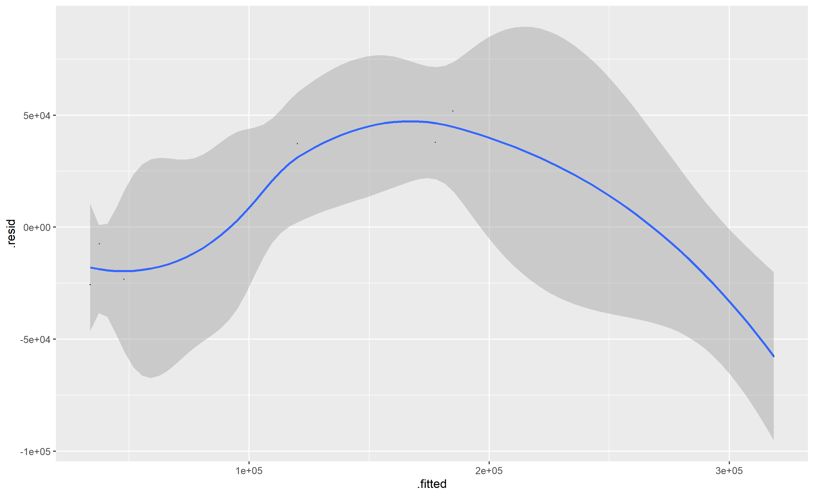

# Final Project: An Examination of Human Development in Peru

## Political Subdivisions

Peru has 3 administrative divisions. Because of the large size of Peru, my analysis was limited largely to the 2nd and 3rd administrative divisions, as my computer could not process the roughly 330 million gridcells required to look at Peru as a whole. Because of this my analysis mostly centered around the Lima region of Peru, while later zooming in on Huancabamba, Peru. Pictured below is a map showing Peru's 1st and 2nd administrative divisions.

.png)

## Lima Region Population

The above images show population density throughout the Lima region. The Lima region of Peru includes Peru's capital (also named Lima), and is located in Western Peru, on the Pacific coast. As the map and accompanying chart show, Lima's most densely populous districts are Cañete, Huaura, and Huaral. This makes sense as those districts are all on Peru's Pacific coast, and therefore have port access. The access to industry presumably explains the heavy population centers. The interior districts of the Lima region have less densely populated areas which may be explained by their lack of port access, and/or their status as suburban areas.

Below, a histogram showing Lima's population centers is displayed. The variance in population count shown by the histogram suggests that the different regions of Lima did not develop uniformly. There are many possible explanations for this such as some areas being zoned for commerce rather than residence, wealthier people wanting and paying for more land, driving down the population count in some suburban areas, and a myriad of other reasons.

Pictured below is a four variable regression showing the Lima region's population and land cover/land use data. The land cover land use data includes topography, water, vegetation, and nighttime lights data. The model fits the actual population nicely, with an r squared value of .8831, suggesting that the land use/land cover data are accurate predictors of population. The points below the line suggest that their populations are slightly lower than the land use/land cover data would indicate, and the points above the line have slightly higher populations than the four variables would predict.

## Access to Healthcare and Roadways in Huancabamba, Peru

Huancabamba, Peru is located in the Northeast corner of the country, near the Ecuadorean border. Huancabamba was chosen for its population count (about 124,800), making the computations manageable in terms of grid cells.
