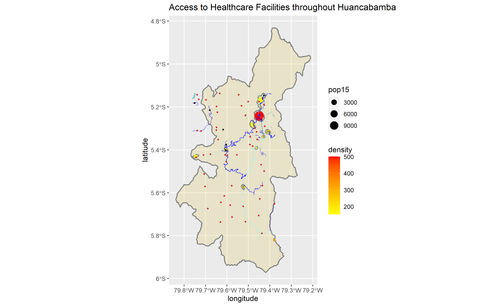

# Project 3

## Access to Healthcare Facilities in Huancabamba, Peru.

### Question 1
Huancabamba has a total population of 128,742 with 27 distinct urban areas.

### Question 2
Huancabamba's urban area population densities range form approximately 500 people per square kilometer to approximately 200 people per square kilometer. The urban are with the biggest population has a population of approximately 11,600 people, and the urban area with the smallest population has a population of approximately 215 people.

### Question 3 
234 unclassified roadways and 16 walking paths were omitted from the plotted data, keeping the roadways plotted to driveable roadways of known type. These included primary, secondary, tertiary, residential, service, trunks, and tracks. There were 438 roadways plotted. The roadways seem to mainly traverse through the center of Huancabamba, where some of the bigger urban areas are. The roadways don't seem to provide interconnectivity throughout the region as a whole. Additionally, there is a concentration of roadways along the northwest corner of Huancabamba, despite no urban area being shown.

### Question 4
60 healthcare facilities were plotted. 54 of those healthcare facilities were labeled as doctors' offices. These are represented by the red dots. 6 clinics are shown by the black dots. There seems to be room for improvement within the healthcare facility data, which was obtained from the HDX database. The only descriptive categories of the healthcare facility data were name, operator, source, and "amenity." The names didn't reveal much, as many were simply named after saints. All of the operators were listed as being the regional government. This means that there is a possibility that the database omitted private healthcare facilities. The "amenity" column was how HDX differentiated between a doctors' office and a clinic. It would have been helpful to know the capactities, specializations, and capabilities of the offices and clinics. Additionally, the sources were listed as either "Bing" or "N/A" which suggests that a formal study detailing healthcare facilities in Huancabamba may not have been undertaken, and/or the Peruvian government's list of healthcare facilities in the region is either nonexistent or incomplete. Access to better data would have made plotting the healthcare facilities more concise, and it would've increased the accuracy of the map as a whole. Many of the doctors offices and clinics appear to be far away from roadways, suggesting that access to healthcare facilities throughout Huancabamba is limited. A possible explanation for this is elevation. Huancabamba is located in the Andes mountains, and its average elevation is about 6,000 feet.
