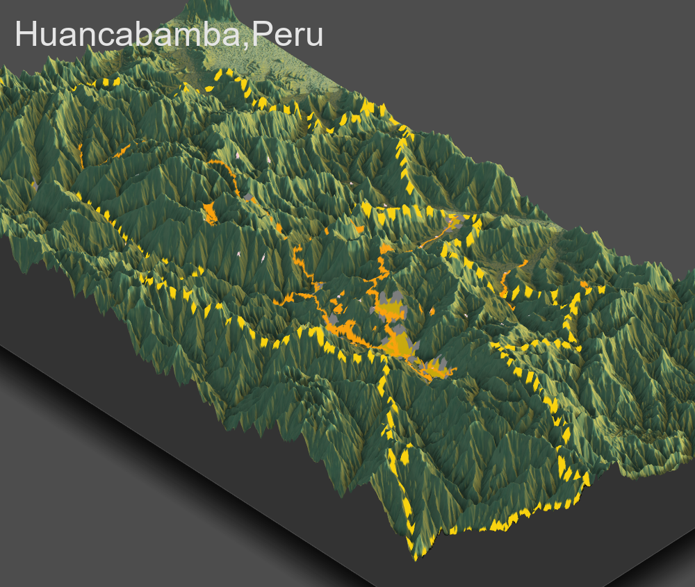

Above is a 3D representation of Huancabamba, Peru. Huancabamba is located in the northeast corner of the country, near the Ecuadorean border. As you can see topography has heavily influenced development, as the mountainous region features roadways that largely cover only the center of the region, and the most populous areas are in the valleys. Healthcare facilities are scattered throughout the region, and as a result are often not connected to a major roadway. My hypothesis about that is that there are likely small doctors offices that provide medical care to small village settlements high up in the mountains. My population analysis showed that there are several such villages in Huancabamba.
